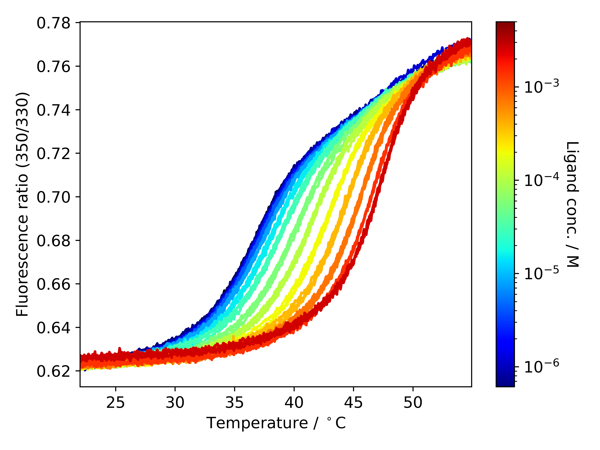
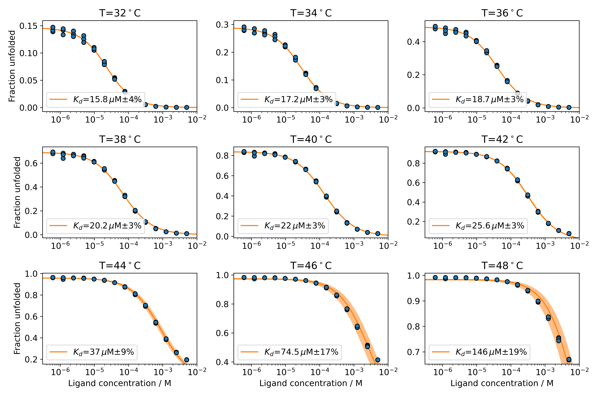
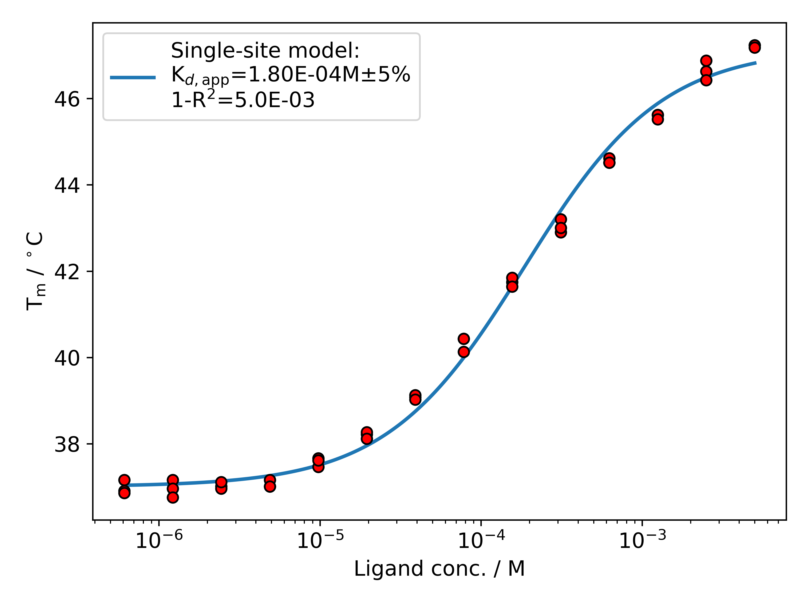
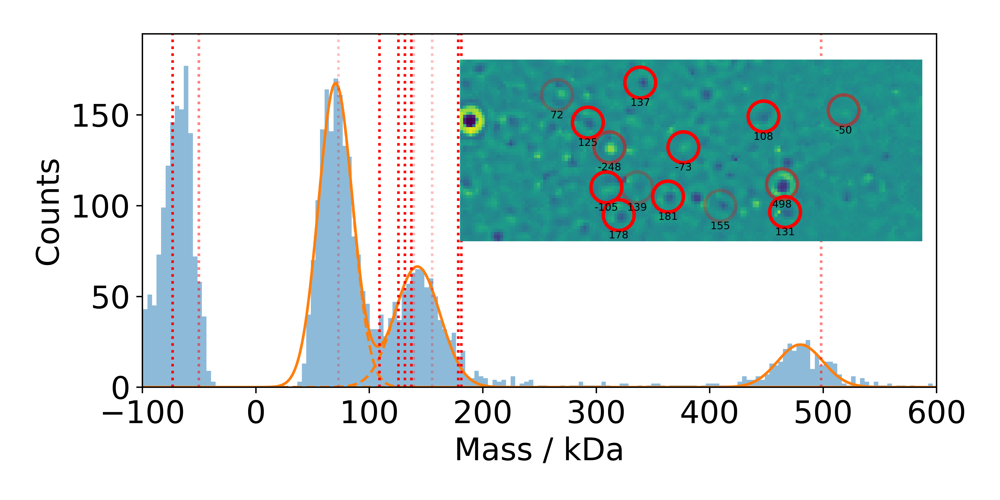
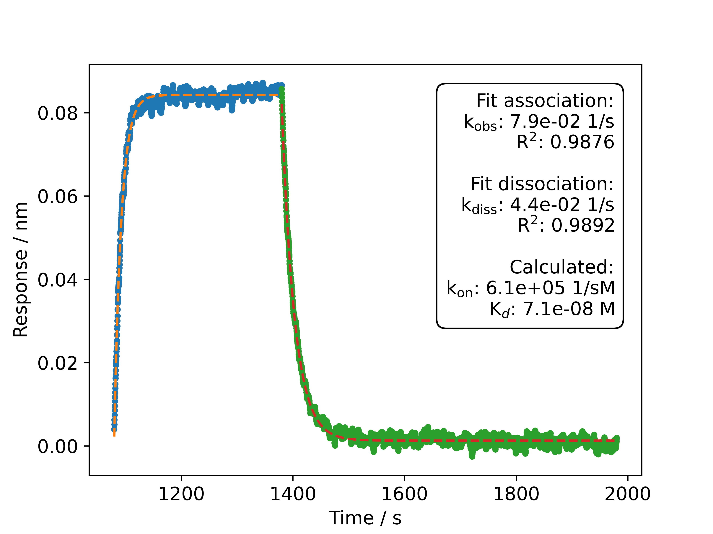
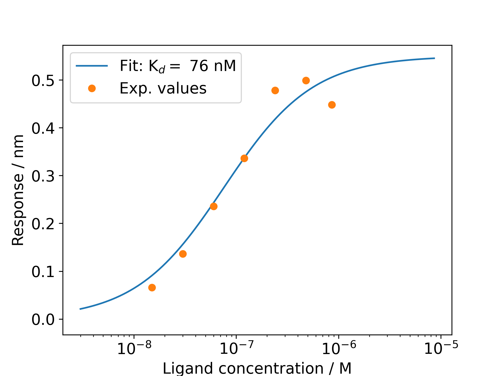
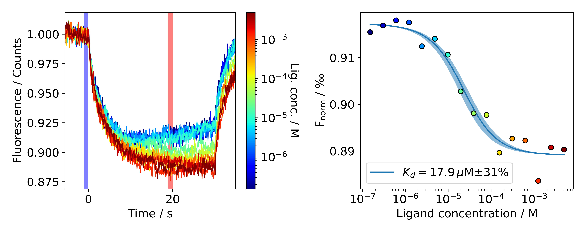
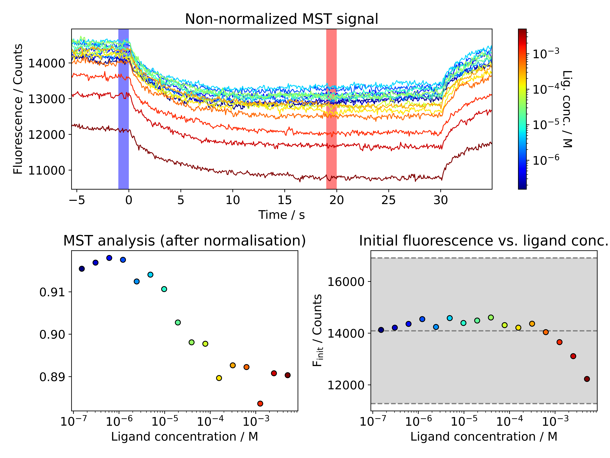

# BioPhyPy: A python library for the analysis of biophysical data

This library contains modules for the analysis of different biophysical techniques. Most of the them are experimental. No warranty whatsoever.
DSF_fit, MST_data and MP_data are available as user-friendly webservers: https://spc.embl-hamburg.de/

**Please cite the respective publications and acknowledge this repository and the SPC facility at EMBL Hamburg when using it for a publication:**
* DSF_fit
  * Niebling, S., Burastero, O., Bürgi, J., Günther, C., Defelipe, L. A., Sander, S., ... & García-Alai, M. (2021). [FoldAffinity: binding affinities from nDSF experiments.](https://www.nature.com/articles/s41598-021-88985-z) Scientific reports, 11(1), 1-17.
  * Burastero, O., Niebling, S., Defelipe, L. A., Günther, C., Struve, A., & Garcia Alai, M. M. (2021). [eSPC: an online data-analysis platform for molecular biophysics.](http://scripts.iucr.org/cgi-bin/paper?S2059798321008998) Acta Crystallographica Section D: Structural Biology, 77(10).
  * Bai, N., Roder, H., Dickson, A., & Karanicolas, J. (2019). [Isothermal analysis of ThermoFluor data can readily provide quantitative binding affinities.](https://www.nature.com/articles/s41598-018-37072-x) Scientific reports, 9(1), 1-15.
* MP_data
  * Niebling, S., Veith, K., Vollmer, B., Lizarrondo, J., Burastero, O., Schiller, J., ... & García-Alai, M. (2022). [Biophysical Screening Pipeline for Cryo-EM Grid Preparation of Membrane Proteins.]( https://www.frontiersin.org/articles/10.3389/fmolb.2022.882288/full) Frontiers in Molecular Biosciences, 535.
 
# Installation

There is no installation necessary. After cloning the repository, add the parental folder to the path and then load the module you want to use. Below is an example:
```python
import sys
# Load parental folder that contains BioPhysPy folder
sys.path.append("../")
# Load python class
from BioPhyPy.DSF_fit import DSF_binding
```

# Modules

Currently BioPhyPy contains the following modules:
* DSF_fit: Differential scanning fluorimetry
* MP_data: Mass photometry
* BLI_data: Biolayer interferometry
* MST_data: Microscale thermophoresis

## DSF_fit: Differential scanning fluorimetry
 * Visualization of DSF data
 * Isothermal analysis
 * Tm analysis

### Load and plot DSF data

```python
# Load modules
import sys
# Add parental folder that contains module to path
sys.path.append("../")
# Load module
from BioPhyPy.DSF_fit import DSF_binding

# Parameters, adjust!
fn = './2405_ndsf_example/example.xlsx'
# Decide whether to load '330nm', '350nm' or 'Ratio' data
which = 'Ratio'

# Load data
test = DSF_binding()
# Specify temperature window
window = [22, 55]

# Create list with analyte concentrations
# Here it was a serial dilution with 14 concentrations
# starting at 5 mM
concs = []
for i in range(14):
    concs.append(5E-3*0.5**i)
# Pure protein without analyte
concs.append(0)
# Experiment was run in triplicates
concs = 3*concs

# Load data
test.load_xlsx(fn=fn, concs=concs, which=which, window=window, load_fit=False)
# Protein Concentration
test.pconc = 10E-6
# Plot fluorescence signal
fig, ax = test.plot_fluo()
# Save figure
fig.savefig('./fluo.pdf')
```


### Do isothermal analysis to obtain Kd

```python
# Load modules
import sys
# Add parental folder that contains BioPhysPy to path
sys.path.append("../")
# Load python class
from BioPhyPy.DSF_fit import DSF_binding

# Parameters, adjust!
fn = './2405_ndsf_example/example.xlsx'
# Decide whether to load '330nm', '350nm' or 'Ratio' data
which = 'Ratio'

# Load data
test = DSF_binding()
# Specify temperature window
window = [22, 55]

# Create list with analyte concentrations
# Here it was a serial dilution with 14 concentrations
# starting at 5 mM
concs = []
for i in range(14):
    concs.append(5E-3*0.5**i)
# Pure protein without analyte
concs.append(0)
# Experiment was run in triplicates
concs = 3*concs

# Load data
test.load_xlsx(fn=fn, concs=concs, which=which, window=window, load_fit=False)
# Protein Concentration
test.pconc = 10E-6

# Local fit of fluorescence curves
test.fit_fluo_local()
# Subsequent global fit
test.fit_fluo_global()
# Plot fits
fig, ax = test.plot_fit_fluo()
fig.savefig('./fluo_fit.pdf')
# Define temperatures for isothermal analysis, should be around Tm
test.isothermal_ts = [32,34,36,38, 40, 42, 44, 46, 48] 
# Isothermal analysis
test.fit_isothermal()
# Plot isothermal analysis
fig, ax = test.plot_fit_isothermal(show_only_kd=True)
fig.savefig('./iso.pdf')
```


### Melting temperature analysis

```python
# Load modules
import sys, os
# Add parental folder that contains BioPhysPy to path
sys.path.append("../")
# Load python class
from BioPhyPy.DSF_fit import DSF_binding

# Parameters, adjust!
fn = './2405_ndsf_example/example.xlsx'
# Decide whether to load '330nm', '350nm' or 'Ratio' data
which = 'Ratio'

# Load data
test = DSF_binding()
# Specify temperature window
window = [22, 55]

# Create list with analyte concentrations
# Here it was a serial dilution with 14 concentrations
# starting at 5 mM
concs = []
for i in range(14):
    concs.append(5E-3*0.5**i)
# Pure protein without analyte
concs.append(0)
# Experiment was run in triplicates
concs = 3*concs

# Load data
test.load_xlsx(fn=fn, concs=concs, which=which, window=window, load_fit=False)
# Protein Concentration
test.pconc = 10E-6

# Determine melting temperatures from 1st derivative 
test.tms_from_derivatives()
# Specify fitting model: 'single' site or 'hill'
tms_fit = 'single' # 
test.fit_tms(fit=tms_fit)
# Plot melting temperatures and fit
fig, ax = test.plot_tms()
fig.savefig('./tms_%s.pdf' % tms_fit)
```


## MP_data: Mass photometry 
 * Visualization of mass photometry data
 * Generation of histograms and gaussian fitting
 * Can also read movie file to show frames in combination with histogram

### Mass photometry histogram
```python
import sys
import matplotlib.pyplot as plt
# Add parental folder that contains BioPhysPy to path
sys.path.append("../")
# Load python class
from BioPhyPy import MP_data

# Adjust font size
fs = 18
plt.rcParams.update({'font.size': fs})

# Histogram file
# This is the linux path syntax, for Windows it needs to be adjusted, e.g. by using \ instead of /
fn ='./folder/example.h5'

# Default parameters for processing
# Limits for
show_lim = [-100, 600]
guess_pos = [66, 148, 480]
max_width=20
# Load eventsFitted
dataset = MP_data(fn=fn, mp_fn=mp_fn)
# Create histogram
dataset.create_histo(bin_width=4)
# Fit bands in mass space
dataset.fit_histo(guess_pos=guess_pos, tol=30, cutoff=0, xlim=[-100,1500], max_width=max_width)
fig.savefig('./mst_initfluo.pdf')
# Create wider plot than default
fig, ax = plt.subplots(1, figsize=[8, 4])
# Plot histogram
dataset.plot_histo(xlim=show_lim, ax=ax, show_labels=True, short_labels=True, show_counts=True)

# Save plot
fig.savefig('./mp_plot.pdf')
```


### Optional: Showing frame from movie as inlet

```python
import sys, glob, os
# Add parental folder that contains BioPhysPy to path
sys.path.append("../")
import numpy as np
# Load python class
from BioPhyPy import MP_data

# Font size
fs = 18
plt.rcParams.update({'font.size': fs})

# Histogram file
# This is the linux path syntax, for Windows it needs to be adjusted, e.g. by using \ instead of /
fn ='./folder/events.h5'
# Movie file
mp_fn = './folder/movie.mpr'

# Default parameters for processing
# Limits for
show_lim = [-100, 600]
guess_pos = [66, 148, 480]
max_width=20
# Load eventsFitted and movie file
dataset = MP_data(fn=fn, mp_fn=mp_fn)
# Set parameters for later plot of the frame
# Analyze movie for later inlet
# Frame with largest numbers of fitted events above threshold is chosen
dataset.analyze_movie(frame_range=2, frame='largest', threshold=50, show_lines=True)
# Create histogram
dataset.create_histo(bin_width=4)
# Fit bands in mass space
dataset.fit_histo(guess_pos=guess_pos, tol=30, cutoff=0, xlim=[-100,1500], max_width=max_width)

# Create plot
fig, ax = plt.subplots(1, figsize=[8, 4])
dataset.plot_histo(xlim=show_lim, ax=ax, show_labels=False, short_labels=True, show_counts=False, contrasts=False)

# Save plot
fig.savefig('./mp_inlet.pdf')
```



## BLI_data: Bilayer interferometry 
* Visualization of BLI data
* Kinetic fits not fully implemented yet

### Showing sensograms
```python
# Load modules
import sys
# Add parental folder that contains BioPhysPy to path
sys.path.append('../')
# Load module
from BioPhyPy import BLI_data

# Font size
fs = 12
matplotlib.rcParams.update({'font.size': fs})

# Folder with raw data
# This is the linux path syntax, for Windows it needs to be adjusted, e.g. by using \ instead of /
folder = './experiment_folder/'

# Initialize instance
bli_data = BLI_data(folder=folder)
# Remove jumps (use average of first 3 points)
bli_data.remove_jumps(xshift=3)
# Align curves to beginning of association (step 3)
bli_data.align(step=0, location='start')
# Smooth curves with a 21 point window
bli_data.smooth(window_length=21)

# Plot signal for binding
fig, ax = bli_data.plot(legend='SampleID', legend_step=3, abbrev_step_names=True, steps=[0,1,2,3,4], sensors=range(1,8))
# Save plot
fig.savefig('./bli_plot.pdf')
```


#### Example for kinetic fit (experimental)

```python
# Load modules
import sys
# Add parental folder that contains BioPhysPy to path
sys.path.append('../')
from BioPhyPy import BLI_data

# Font size
fs = 12
matplotlib.rcParams.update({'font.size': fs})

# Folder with raw data
# This is the linux path syntax, for Windows it needs to be adjusted, e.g. by using \ instead of /
folder = './experiment_folder/'

# Initialize instance
bli_data = BLI_data(folder=folder)
# Remove jumps (use average of first 3 points)
bli_data.remove_jumps(xshift=3)
# Align curves to beginning of association (step 3)
bli_data.align(step=2, location='end')
# Smooth curves with a 21 point window
bli_data.smooth(window_length=21)
# # Subtract reference sensor
bli_data.subtract(ref_sensor=7, sample_sensors=[0,1,2,3,4,5,6,7])
# Align again
bli_data.align(step=4, location='end')

# Do fit of selected sensor and plot it
fig, ax = bli_data.fit_data(sensors=[4], step_assoc=3, step_dissoc=4, func='monoexp', plot=True)
# Save plot
fig.savefig('./bli_fit.pdf')
```



#### Example for steady-state fit

```python
# Load modules
import sys
# Add parental folder that contains BioPhysPy to path
sys.path.append('../')
from BioPhyPy import BLI_data

# Font size
fs = 12
matplotlib.rcParams.update({'font.size': fs})

# Folder with raw data
# This is the linux path syntax, for Windows it needs to be adjusted, e.g. by using \ instead of /
folder = './experiment_folder/'

# Initialize instance
bli_data = BLI_data(folder=folder)
# Remove jumps (use average of first 3 points)
bli_data.remove_jumps(xshift=3)
# Align curves to beginning of association (step 3)
bli_data.align(step=2, location='end')
# Smooth curves with a 21 point window
bli_data.smooth(window_length=21)
# # Subtract reference sensor
bli_data.subtract(ref_sensor=7, sample_sensors=[0,1,2,3,4,5,6,7])
# Align again
bli_data.align(step=4, location='end')

# Steady state fit
bli_data.steady_state_fit(step=3, sample_sensors=[0,1,2,3,4,5,6])
# Save plot
fig.savefig('./steady-state.pdf')
```


## MST_data: Microscale thermophoresis
* Visualize data and fit affinities

### Do MST analysis

```python
# Load modules
import sys
import matplotlib.pyplot as plt
# Add parental folder that contains BioPhysPy to path
sys.path.append('../')
# Load module
from BioPhyPy import MST_data

# Folder
fn = './mst_example.xlsx'

# Define fontsize for plots
fs = 14
plt.rcParams.update({'font.size': fs})

# Load data
data = MST_data(fn=fn)
# Normalize signal
data.normalize()
# Select "hot" region for MST analysis (seconds)
data.calc_fnorm(hot=20)
# Define protein concentration
data.pconc = 10E-6
# Fit Kd with fixed protein concentration
data.get_kd(fix_pconc=True)
# Plot data
fig, ax = data.plot()
# Save figure 
fig.savefig('./mst.pdf')
```


### Check initial fluorescence

```python
# Load modules
import sys
import matplotlib.pyplot as plt
# Add parental folder that contains BioPhysPy to path
sys.path.append('../')
# Load module
from BioPhyPy import MST_data

# Folder
fn = './2405_mst_example/mst_example.xlsx'

# Define fontsize for plots
fs = 14
plt.rcParams.update({'font.size': fs})

# Load data
data = MST_data(fn=fn)
# Select "hot" region for MST analysis (seconds)
data.calc_fnorm(hot=20)

# Plot data
fig, ax = data.plot_init_fluo()
```


## Discontinued modules

* CD_data
* IR_data
* MS_data
* DLS_data

