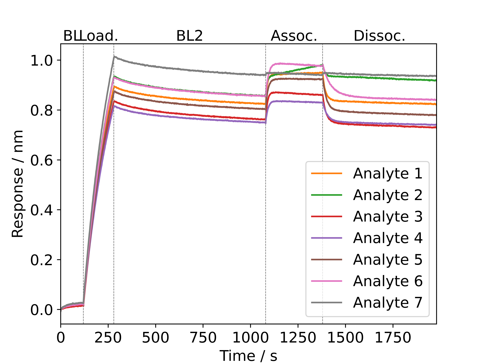

# libspec: A python library for the analysis of biophysical data

This library contains modules for the analysis of different biophysical techniques. Most of the them are experimental. No warranty whatsoever.
DSF_fit, MST_data and MP_data are available as user-friendly webservers: https://spc.embl-hamburg.de/

**Please cite the respective publications and acknowledge this repository and the SPC facility at EMBL Hamburg when using it for a publication:**
* DSF_fit
  * Niebling, S., Burastero, O., Bürgi, J., Günther, C., Defelipe, L. A., Sander, S., ... & García-Alai, M. (2021). [FoldAffinity: binding affinities from nDSF experiments.](https://www.nature.com/articles/s41598-021-88985-z) Scientific reports, 11(1), 1-17.
  * Burastero, O., Niebling, S., Defelipe, L. A., Günther, C., Struve, A., & Garcia Alai, M. M. (2021). [eSPC: an online data-analysis platform for molecular biophysics.](http://scripts.iucr.org/cgi-bin/paper?S2059798321008998) Acta Crystallographica Section D: Structural Biology, 77(10).
  * Bai, N., Roder, H., Dickson, A., & Karanicolas, J. (2019). [Isothermal analysis of ThermoFluor data can readily provide quantitative binding affinities.](https://www.nature.com/articles/s41598-018-37072-x) Scientific reports, 9(1), 1-15.
* MP_data
  * Niebling, S., Veith, K., Vollmer, B., Lizarrondo, J., Burastero, O., Schiller, J., ... & García-Alai, M. (2022). [Biophysical Screening Pipeline for Cryo-EM Grid Preparation of Membrane Proteins.]( https://www.frontiersin.org/articles/10.3389/fmolb.2022.882288/full) Frontiers in Molecular Biosciences, 535.

## Modules

### DSF_fit
 * Visualization of DSF data
 * Isothermal analysis
 * Tm analysis

### MP_data
 * Visualization of mass photometry data
 * Generation of histograms and gaussian fitting

#### Jupyter notebook example
```python
%matplotlib tk
import sys
sys.path.append("../")
# Load python class
from libspec import MP_data

# File folder, adjust this one
fn = './experiments/001_mpdata.h5'

# Parameters to search for gaussians
guess_pos = [60, 80]
tol = 20
max_width = 10

# Load eventsFitted
dataset = MP_data(fn=fn)
# Create histogram
dataset.create_histo(bin_width=4)
# Fit bands in mass space
dataset.fit_histo(guess_pos=guess_pos, tol=tol, xlim=[-100,1000], max_width=max_width)

# Define fontsize for plot
fs = 18
# Get fonts bigger
plt.rcParams.update({'font.size': fs})

# Plot data
fig, ax = dataset.plot_histo(xlim=[-500, 1000])
# Save figure
fig.savefig(fn.replace('.h5','.pdf'))
```


### MST_data
* Visualize data and fit affinities

### BLI_data
* Visualization of BLI data
* Kinetic fits not fully implemented yet

#### Jupyter notebook example
```python
# Load modules
import matplotlib.pyplot as plt
import matplotlib
import sys
sys.path.append('../')
from libspec import BLI_data

# Font size
fs = 12
matplotlib.rcParams.update({'font.size': fs})

# Folder with raw data
folder = './experiment_folder/'

# Initialize instance
bli_data = BLI_data(folder=folder)
# Remove jumps (use average of first 3 points)
bli_data.remove_jumps(xshift=3)
# Align curves to beginning of association (step 3)
bli_data.align(step=0, location='start')
# Smooth curves with a 21 point window
bli_data.smooth(window_length=21)

# Plot signal for binding
fig, ax = bli_data.plot(legend='SampleID', legend_step=3, abbrev_step_names=True, steps=[0,1,2,3,4], sensors=range(1,8)) 
```


### Discontinued modules

* CD_data
* IR_data
* MS_data
* DLS_data

